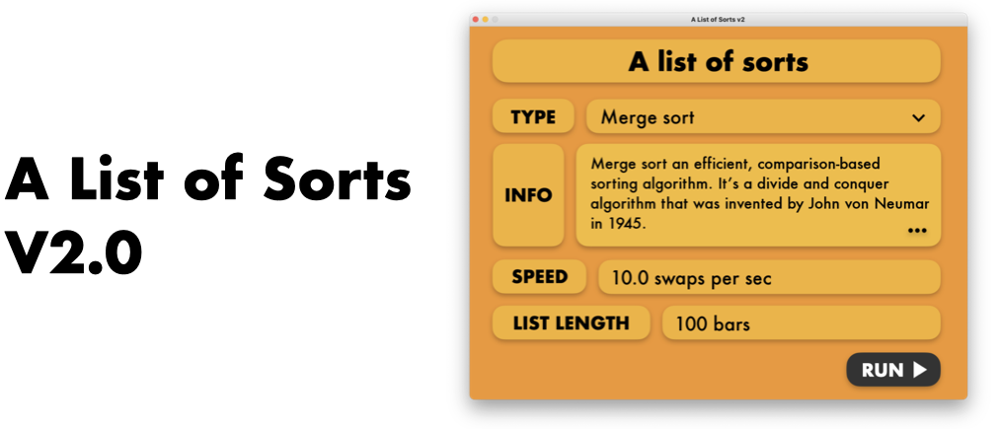

Visualisation for sorting algorithms v2. Upped a notch from [version 1](https://github.com/benwoo1110/A-List-of-Sorts). This program provides animates simple, common and popular sorting algorithms, to allow people to learn more able these algorithms and how the work.</br>

## Sorting Algorithms:
* Bubble sort
* Insertion sort
* Merge sort
* Quick sort
* Radix sort
* Bogo sort

## Depencencies:
* python 3.x
* pygame
* yyaml 
</br>
See: [requirements.txt](requirements.txt)

#### Manual install: 
```css
pip3 install pyyaml pygame
```

## To run to the program:
#### For macos/linux:
run `start.sh` file
```css
chmod +x start.sh
./start.sh
```
#### For windows:
run `start.bat` file
```css
.\start.bat
```
<br />

#### Done by: Benedict Woo Jun Kai | Open-source [MIT license](LICENSE)